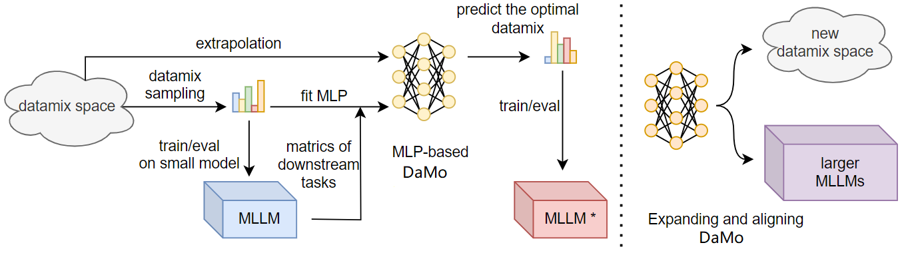
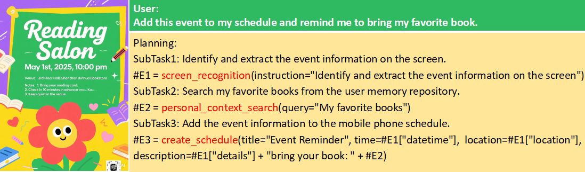

# DaMo: Data Mixing Optimizer in Fine-tuning Multimodal LLMs for Mobile Phone Agents

paper: [DaMo: Data Mixing Optimizer in Fine-tuning Multimodal LLMs for Mobile Phone Agents](http://arxiv.org/abs/2510.19336)

## Data Mixing Optimizer

DaMo is a novel solution for predicting optimal data mixtures in multitask supervised fine-tuning of multimodal large language models (MLLMs). Left: Given $m$ training sets with a batch size of $b$, all possible mixture combinations constitute the data mixing space. We sample a small number of data mixture from this space, train them on a small MLLM, and then evaluate downstream task performance. Using the data mixture as inputs and the metrics as outputs, we fit a MLP to establish the DaMo. By extrapolating from the data mixing  space, we predict the optimal data mixture to train the MLLM. Right: Demonstrates the extension and alignment of DaMo to other MLLMs and new data mixing spaces.

### Prerequisites for All Environments
```
pip install uv
cd DaMo
uv sync
```

### Run the Code
#### Step 1: Generate Complete $P_{fix}$
First, you need to sample random proportions. Run the following code with the specified `number_of_training_datasets` and `batch_size` to obtain all possible `data mixture proportion` values in the complete $P_{fix}$:

```
uv run python get_P_fix.py
```

#### Step 2: Sample few proportions, train MLLM, and evaluate performance
Randomly sample a small number of `data mixture proportion` values from $P_{fix}$, train the MLLM, and evaluate its performance on the downstream task. For brevity, the model training framework code and open-source benchmark evaluation code are not duplicated here; refer to `mllm_train_and_eval.py`. For the evaluation process of PhoneAgentBench, see [`phoneAgentBench`](#phoneAgentBench). We provide a small set of experimental sample points for fitting the MLP model, which can be found in `DaMo/src/processed_data_random_50.xlsx`.


#### Step 3: Fit MLP model and evaluate its performance
To predict the downstream task performance of the MLLM after training on unseen data mixtures, use the existing experimental sample points to fit an MLP model. The input of the MLP model is `data mixture proportion` and `training step`, while the output is `downstream task performance`. Evaluate the $R^2$ score of the MLP model through 10-fold cross-validation:

```
uv run python mlp_regressor.py
```

#### Step 4: Predeict downstream task performance of unseen data mixtures
Based on the MLP model, predict the downstream task performance of the MLLM after training on unseen data mixtures, obtain the optimal data mixture proportion.
```
uv run predict.py
```

#### Step 5: Train MLLM and evaluate performance on predicted optimal data mixture proportion
Train the MLLM using the predicted optimal data mixture proportion and evaluate its performance on the downstream task as in Step 2.

<h4 id="phoneAgentBench"></h4>

## phoneAgentBench

We develop a novel benchmark suite specifically designed for mobile phone agents. This suite encompasses six carefully curated datasets focusing on key mobile phone application tasks, thereby offering a holistic assessment of phone agents' performance across diverse capabilities critical to real-world mobile applications.

- Multimodal Task Planning (MT-Plan)



MT-Plan is designed to evaluate multimodal task planning capabilities in phone agent scenarios. It takes   `<image + query>` as input and outputs a planning structured as a `directed acyclic graph (DAG)`.

Download embedding model from [BAAI/bge-large-zh](https://huggingface.co/BAAI/bge-large-zh/tree/main). Download MLLM checkpoint from [InternVL2_5-4B](https://huggingface.co/OpenGVLab/InternVL2_5-4B/tree/main), [Qwen2.5-VL-3B-Instruct](https://huggingface.co/Qwen/Qwen2.5-VL-3B-Instruct/tree/main), [Qwen2.5-VL-7B-Instruct](https://huggingface.co/Qwen/Qwen2.5-VL-7B-Instruct/tree/main), [InternVL3-14B](https://huggingface.co/OpenGVLab/InternVL3-14B/tree/main) or your SFT checkpoint. Modify the configuration in `eval_mt-plan.py` to specify the paths for the MLLM, embedding model, and dataset. Run the following code to obtain the model's predictions and evaluation results on the MT-Plan task.

```
uv run python eval_mt-plan.py
```
